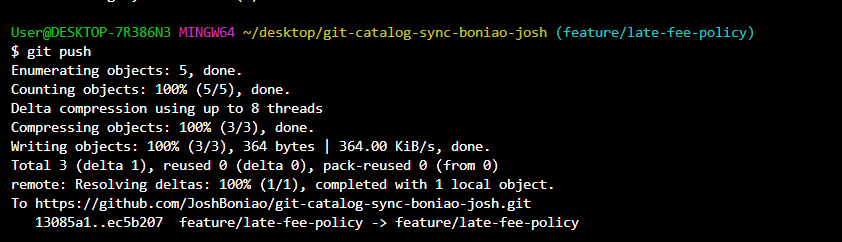
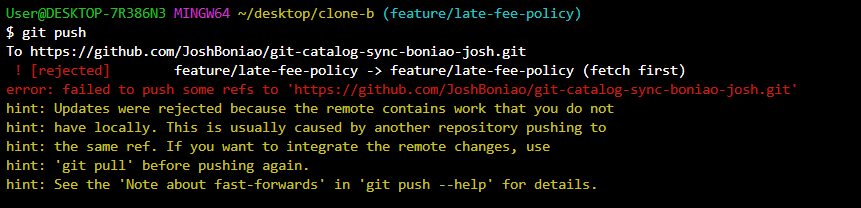
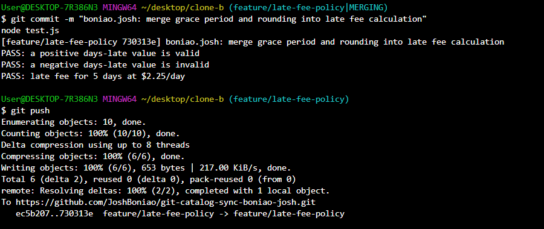
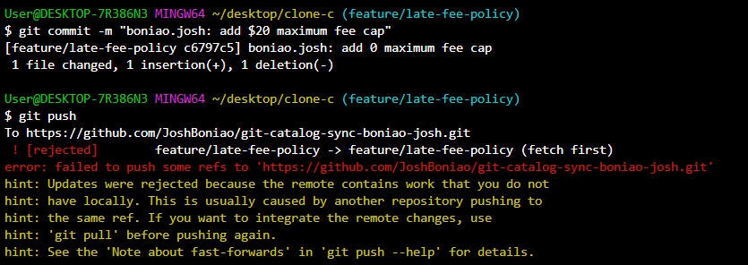
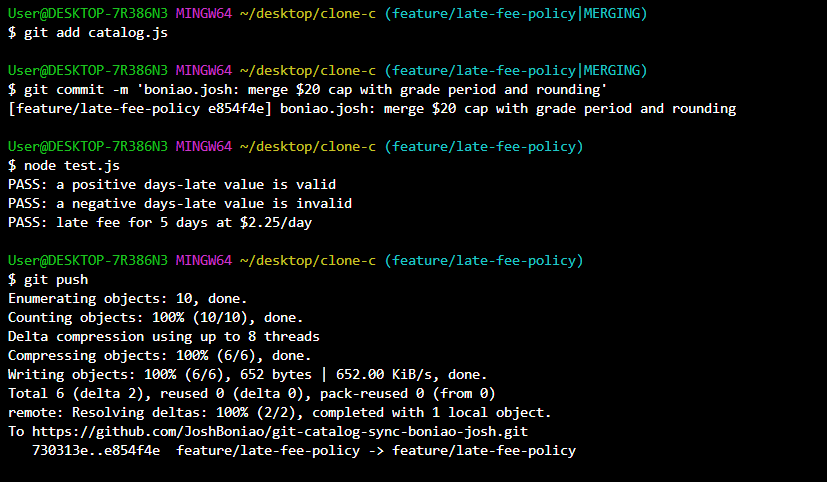
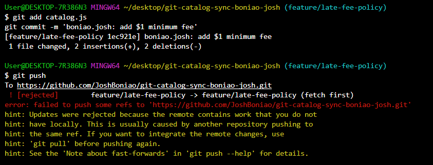

# WORKFLOW.md — git-catalog-sync-cabating-johnpaul

This document walks through each task in the late fee policy sync lab, with screenshot evidence and answers to the workflow questions.

## Task 1: Push a change from Clone A

Added a 1-day grace period to `calculateLateFee`, then committed and pushed.



## Task 2: Diverge from Clone B — and get rejected

Without fetching, Clone B changed truncation to rounding. The commit worked, but the push was rejected because the remote had moved ahead.



## Task 3: Reconcile with a merge

Fetched and merged, resolving the conflict so the grace period and rounding both stay. Tests passed, then pushed.



## Task 4: Bring in the third contributor — and get rejected again

Clone C, still on the original code, added a $20 fee cap. The push was rejected because the branch had moved twice since Clone C last synced.



## Task 5: Reconcile a three-way merge

Fetched and merged, resolving the conflict so the grace period, rounding, and $20 cap all work together. Tests passed, then pushed.



## Task 6: Diverge a third time — reconcile with a rebase

Clone A, unsynced since Task 1, added a $1 minimum fee. The screenshot shows the push being rejected because the remote had moved ahead. I then fetched, rebased my commit onto the latest remote branch, and pushed successfully.



## Task 7: Merge into main, tag, and document

Merged f`eature/late-fee-policy` into `main`, pushed, then tagged the final commit `v1.0-synced` and pushed the tag.

---

## Workflow Questions

### 1. Walk through the final `calculateLateFee` function and name which contributor's change is responsible for each part.

```javascript
function calculateLateFee(daysLate, ratePerDay) {
  if (daysLate <= 1) return 0;
  let fee = Math.round(daysLate * ratePerDay);
  fee = Math.min(20, fee);
  fee = Math.max(1, fee);
  return fee;
}
```

- `if (daysLate <= 1) return 0;` is Clone A, Task 1: the grace period.
- `Math.round(...)` is Clone B, Task 2: rounding instead of truncating.
- `Math.min(20, fee)` is Clone C, Task 4: the $20 cap.
- `Math.max(1, fee)` is Clone A, Task 6: the $1 minimum.

### 2. Compare Task 3's two-way conflict to Task 5's three-way conflict — what got harder with a third line of work?

Task 3 only meant combining two sides. Task 5 meant combining three, so the order the rules apply in mattered, and I had to check that no rule undid another.

### 3. What's the actual difference between how you resolved Task 5 (merge) and Task 6 (rebase)?

`git merge` joins two histories with a merge commit, preserving what actually happened. `git rebase` replays my commit on top of the latest changes, giving a clean linear history. The final code is similar either way.

### 4. If this were a real team of three, what one process change would have prevented all three rejected pushes?

A team rule to pull the latest changes before starting work and again before pushing. Each rejection came from working on outdated code.